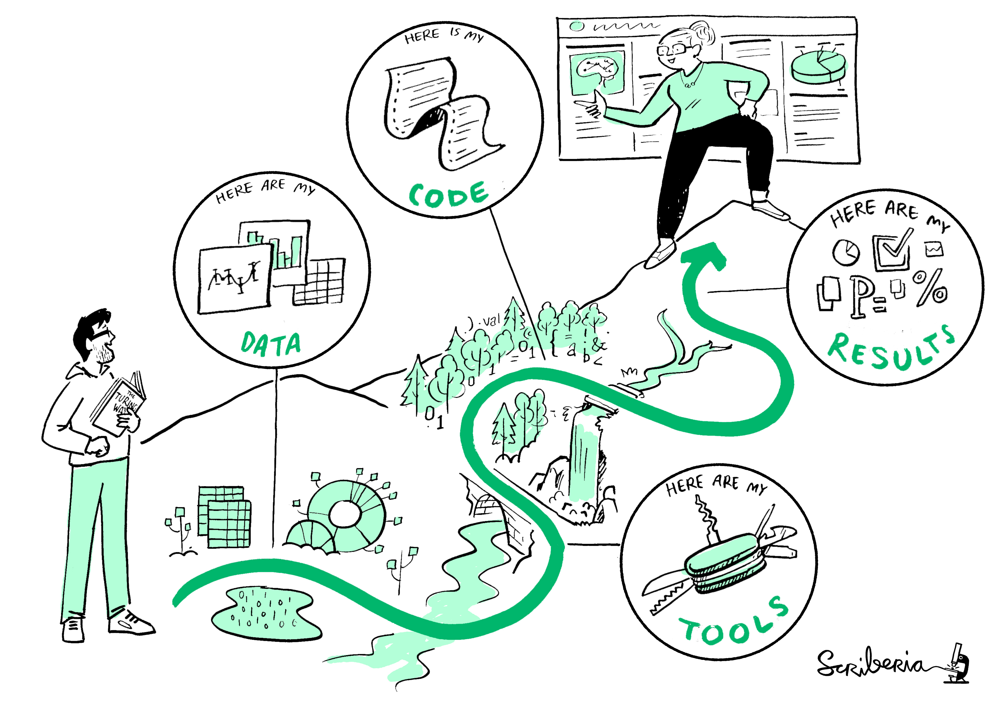

# Introduction to reproducible research

The term `reproducible research` was coined by Jon Claerbout in the 1980s when he wrote an essay on [reproducible](http://sepwww.stanford.edu/sep/jon/reproducible.html) computational research and described the challenges he faced when developing a textbook that incorporated text, data, and computational results into a stand-alone document. According to Claerbout's principle, “scholarship does not only consist of theorems and proofs but also, and perhaps even more importantly, of data, computer code, and a runtime environment which provide readers with the possibility to reproduce all tables and figures in an article.”

Today, reproducible research has become increasingly important as scientific analyses, policy evaluations, and operational workflows rely more heavily on computational methods, large datasets, automation, and collaboration across multiple teams and disciplines. Reproducibility helps improve transparency, strengthen confidence in analytical results, and support evidence-informed decision-making.

This image by *The Turing Way* is a great representation of what Jon Claerbout may have had in mind:

The need for reproducibility is increasing dramatically as data analyses become more complex and involve larger datasets, multiple analysts, and more sophisticated computational tools and workflows.

## What is reproducible research? 

According to a U.S. National Science Foundation (NSF) subcommittee on replicability in science, “reproducibility refers to the ability of a researcher to duplicate the results of a prior study using the same materials as were used by the original investigator. This entails that a result obtained by an experiment or observational study should be achieved again with a high degree of agreement when the study is replicated with the same methodology by different researchers.”

In simpler terms, reproducible research allows others to follow the same analytical steps, use the same data and code, and obtain the same results. This includes reproducing tables, figures, statistical analyses, and conclusions from the original work.

Reproducibility is increasingly recognized as a cornerstone of transparent and trustworthy scientific and analytical practice.

### Terminology distinctions

Reproducible research is sometimes referred to as:

- reproducibility,
- reproducible statistical analysis,
- reproducible data analysis,
- reproducible reporting,
- computational reproducibility,
- and literate programming.

Although these terms are related, they may emphasize different aspects of transparency, automation, and computational workflows.

### Reproducible versus replicable

Replicability means obtaining consistent results across independent studies aimed at answering the same scientific question, where each study has collected its own data.

In other words:

- **Reproducibility** uses the same data and methods.
- **Replicability** uses new data to evaluate whether the same conclusions can still be reached.

Both concepts are essential for strengthening confidence in scientific findings.

### Reproducible versus repeatable

Repeatability measures the variation in measurements taken by a single instrument or person under the same conditions, while reproducibility measures whether an entire study or experiment can be reproduced in its entirety by others.

Repeatability is often associated with precision and consistency within a controlled setting, whereas reproducibility focuses on transparency and independent verification.

This is an important way for researchers and analysts to verify that their own results are valid and are not simply chance artifacts or undocumented computational outcomes.

### Reproducibility crisis

The replication crisis (or reproducibility crisis) is an ongoing methodological challenge in which many scientific studies have proven difficult or impossible to replicate or reproduce. This issue has affected several disciplines, particularly medicine, psychology, and the social sciences.

Some contributing factors include:

- lack of transparency in methods,
- unavailable data or code,
- selective reporting,
- undocumented analytical decisions,
- and insufficient computational documentation.

The reproducibility crisis has increased awareness of the need for open, transparent, and well-documented analytical workflows.

### The problem in the context of public service

In the context of public service and government analytics, reproducibility presents additional challenges:

- Government processes are often not fully transparent.
- The public may not know how decisions are made.
- Analytical workflows are sometimes difficult to trace or verify.
- There may be duplication of work across teams and ministries.
- Staff turnover can result in loss of institutional knowledge.
- Reports and analyses may depend heavily on undocumented manual steps.

Without reproducible workflows, it becomes difficult to validate findings, revisit analyses, or efficiently build upon previous work.

### The solution in the context of public service

Open and reproducible workflows can help address many of these challenges by supporting:

- openness and transparency in government,
- evidence-informed decision making,
- efficiency and consistency,
- collaboration across teams,
- long-term maintainability of analytical work,
- and the ability for others to review, reproduce, improve, or extend existing methods.

Reproducibility also helps reduce errors, improve accountability, and strengthen public trust in analytical and policy processes.

### Barriers to open and reproducible workflows

Despite the benefits, several barriers may limit the adoption of reproducible workflows:

- organizational directives and policies,
- management approval processes,
- data privacy and security requirements,
- limited technical training,
- legacy systems and software,
- time constraints,
- and organizational culture.

Balancing openness with privacy, security, and operational requirements is often one of the key challenges in public-sector analytics.

### What needs to be reproduced?

For evidence-informed decision making, results need to be reproducible. 

The results may include:

- statistical and inferential tables,
- visualizations, figures, and graphs,
- values reported in the text,
- maps and spatial analyses,
- statistical evidence supporting findings (e.g., p-values, confidence intervals, credible intervals),
- model outputs and simulations,
- and automated reports or dashboards.

Ideally, every major analytical output should be traceable back to the original data and computational workflow.

### Motivation

Some important practices that can help make experiments, analyses, processes, and reports more reproducible include:

1. **Don't Read Between the Lines**  
   Clearly document assumptions, methods, and decisions.

2. **Be Strict**  
   Use standardized workflows and naming conventions.

3. **Keep Things Transparent**  
   Make data, code, and methods accessible whenever possible.

4. **Collaborate**  
   Use shared repositories, version control, and peer review.

5. **Automate Your Processes**  
   Reduce manual steps and generate outputs directly from code.

6. **Document Everything**  
   Good documentation is essential for long-term maintainability.

7. **Use Version Control**  
   Tools such as Git help track changes and support collaboration.

## Benefits of reproducibility

- Increased likelihood that the research or analysis is correct.
- Easier verification and peer review of analytical results.
- Improved transparency and accountability.
- Easier independent reproduction of analyses.
- Easier extension of previous work.
- Reusable code and workflows resulting in increased efficiency.
- Reduced duplication of effort.
- Improved collaboration across teams and organizations.
- Better long-term preservation of institutional knowledge.
- More reliable and maintainable analytical processes.

## How to make research reproducible 

1. The first reason to repeat experiments is simply to verify results. Different scientific disciplines may have different criteria for determining what constitutes reliable or acceptable results.

2. Another reason to repeat experiments is to develop the skills necessary to extend established methods and develop new experiments. For this, reproducible methods, tools, platforms, and workflows are essential.

3. Analytical workflows should minimize undocumented manual steps and maximize automation.

4. Reports, figures, and tables should ideally be generated directly from code to reduce the risk of transcription or formatting errors.

5. Data processing, cleaning, analysis, and reporting steps should all be documented clearly enough for another person to follow.

## Requirements for reproducibility

1. The "raw" data should be made available, where "raw" refers to the data prior to any manipulation by the researcher (e.g., prior to any data cleaning or transformation).

2. A complete set of instructions should be provided explaining all steps used in processing and analyzing the data.

3. The analytical workflow should be sufficiently documented so that another person can reproduce the results independently.

4. Computational environments and software dependencies should be clearly identified.

### Additional requirements

a) A set of files should be provided containing the data and code, and it should be possible to create the tables and any data-derived charts, graphics, or visualizations by running the code.

b) Details about the system being used to run the analysis should be documented, including:

- operating system,
- software versions,
- package/library versions,
- patches,
- random number seeds,
- and computational environments.

c) The code should be written in a way that can be readily understood and maintained by others.

d) Open and transparent workflows are encouraged whenever possible. Ideally, data and materials should be publicly available (rather than only “available upon request”), for example through GitHub or trusted data repositories.

e) Reproducibility may also involve one or more of the following:

- Another party (e.g., a reviewer) has successfully reproduced the results and certified them as such.  
- Logs demonstrate that key results were successfully created from the inputs.  
- The key results are directly linked to the underlying data and code so the relationship can be inspected and verified.  

A final requirement, sometimes known as *literate programming*, is that:

f) The entire report is written using code. That is, a file or set of files is provided which, when run:

- imports the data,
- performs the analysis,
- produces all results,
- inserts the results directly into the report,
- and automatically formats the final document.

Modern tools such as R Markdown, Quarto, and Bookdown make this type of fully reproducible reporting increasingly accessible for research, industry, and public-sector workflows.