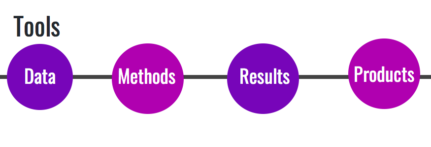
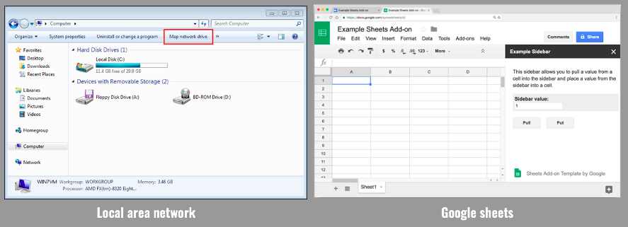
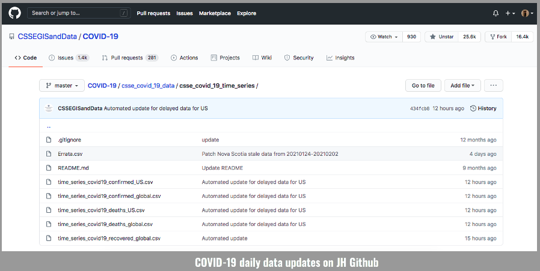
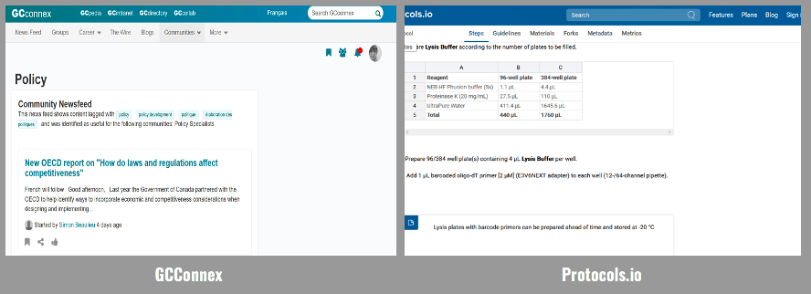
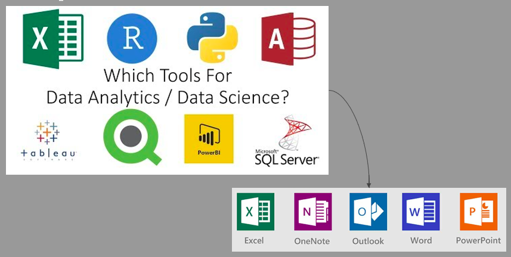
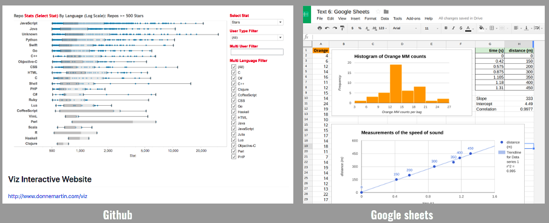

# Tools for reproducible projects

“An article about computational science in a scientific publication is not the scholarship itself,
it is merely advertising of the scholarship. The actual scholarship is the complete software development environment and the complete set of instructions which generated the figures.”
— Jonathan Buckheit and David Donoho, paraphrasing Jon Claerbout 

“In 2002, I felt like I would just remember everything forever,” Karl Broman, a biostatistician at the University of Wisconsin, Madison. “It was only later that it became clear that you start to forget things within a month.”

### Barriers
- Human subject data or proprietary code aren't shared and we need to implement creative solutions 
- Journals and funders don't reward reproducibility
- Analysts need to be taught reproducible methodology and there is a steep learning curve
- Need to make these efforts common place
- Software changes, new versions are released and older code breaks.
- Files are removed or moved and all the code breaks.
- One file is updated but the rest of the code/files are not updated.
- One forgets which files depend on which other files, or what has been changed

## Tools

"Your primary collaborator is yourself 6 months from now, and your past self doesn't answer emails." - software carpentry

In this section, the tools that make reproducibility and open workflows easier are divided into four categories and these are not exhaustive. The categories include tools for data, methods, results, and communication products. 

The basics of research (data) management can be applied to every research project. These concepts include:
i) storing data carefully and securely (according to the appropriate standards in the case of sensitive data)  
ii) backing up frequently and in at least two separate locations     
iii) using a file naming convention so that others within and outside a project can understand a file’s content.   

### Data

The question we can ask ourselves is how can we make the data FAIR: findable, accessible, interoperable, and reusable?

- Findable: e.g. Make data available in trusted data repository  
- Accessible (store in open non-proprietary platforms/formats): e.g. include comprehensive metadata
- Interoperable (standardized and has identifiers): e.g. store in open (non-proprietary) formats
- Reusable (open with comprehensive metadata): For open data, attach a licence or rights waiver, or a permanent identifier (i.e. DOI)  

Some tools include:   
- Shared drive/Local Area Network (LAN)/Sharepoint  

- Google sheets / OpenRefine  
- Open government portal  
- GitHub  

### Methods

How can we make the process by which we do our work more open and reproducible? How could others access this work? 

Some tools include:   
- GCconnex   
- Protocols.io  

- GitHub  

### Results

How can we adequately share the results with team members and tweak the methods to answer new questions/test new hypotheses?

Some tool examples include:   
- Shared drive/LAN/Sharepoint and connection with respective analytic/data science softwares   
- Google docs and other microsoft suites   

- Github  

### Communication products

Once our work is done - how can we make it most accessible?  
 
- Cochrane reports  
- Open access publications  
- Public talks  
- Media/Social Media  
- Github  

Other considerations:   
1. Share data, software, workflows, methods and results in open trusted repositories
2. Persistent links, permanent identifiers for data, code, digital artifacts upon which the results depend
3. Enable credit for shared digital scholarly objects with citations
4. Adequately document to facilitate reuse
5. Use Open Licensing
6. Journals should conduct a reproducibility check
7. Funding agencies should instigate new research programs and pilot studies

`Stodden, McNutt, Bailey, Deelman, Gil, Hanson, Heroux, Ioannidis, and Taufer (2016) in Science Policy Forum`

