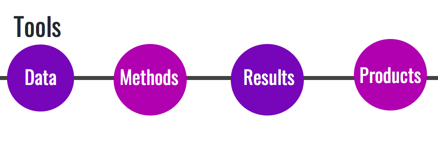
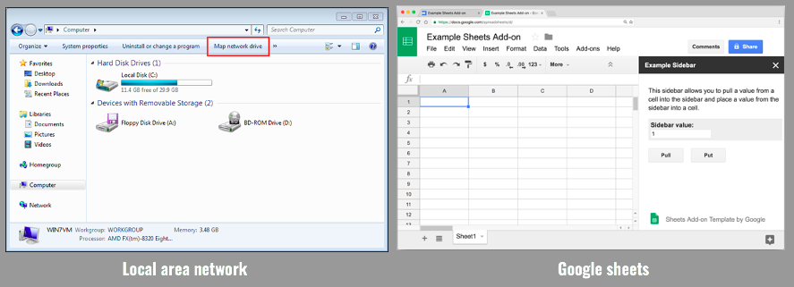
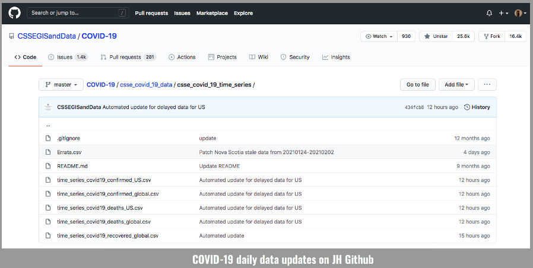
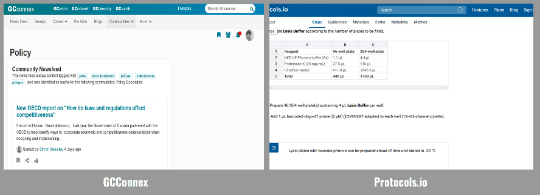
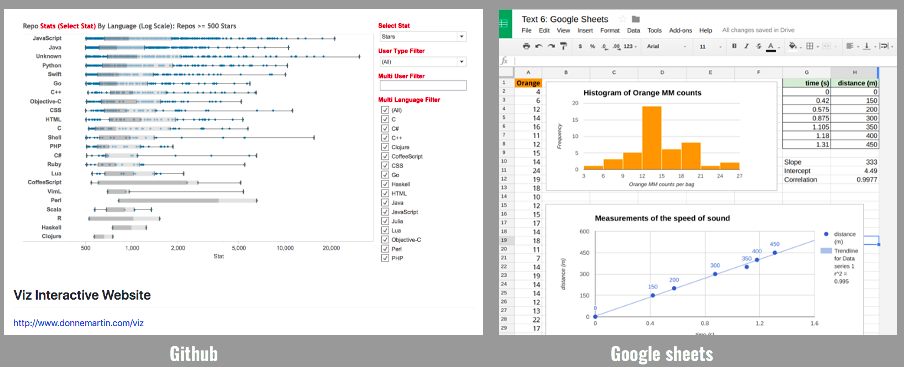

# Tools for reproducible projects

> “An article about computational science in a scientific publication is not the scholarship itself; it is merely advertising of the scholarship. The actual scholarship is the complete software development environment and the complete set of instructions which generated the figures.”  
> — Jonathan Buckheit and David Donoho, paraphrasing Jon Claerbout

> “In 2002, I felt like I would just remember everything forever.”  
> — Karl Broman, biostatistician at the University of Wisconsin, Madison  
>
> “It was only later that it became clear that you start to forget things within a month.”

Reproducible research depends not only on good intentions, but also on the use of appropriate tools, workflows, documentation practices, and organizational habits. As projects become more computationally complex and collaborative, it becomes increasingly difficult to manage data, track analytical changes, document methods, and reproduce results without structured systems and tools.

Tools for reproducible research help analysts and researchers:

- organize and preserve data,
- automate workflows,
- track analytical changes,
- collaborate effectively,
- generate reproducible reports,
- and share methods and results transparently.

The goal is not simply to make research easier to reproduce today, but also to make it understandable and reusable months or years later by collaborators, reviewers, future team members, or even our future selves.

## Barriers

Despite growing awareness of reproducibility, several practical and institutional barriers still exist:

- Human subject data or proprietary code may not be shareable, requiring creative and secure solutions.
- Journals and funding agencies do not always reward reproducibility efforts.
- Analysts and researchers need training in reproducible methodologies, and the learning curve can initially be steep.
- Reproducible workflows are not yet standard practice in many organizations.
- Software evolves over time; new versions may cause older code to break.
- Files may be moved, renamed, or deleted, causing workflows to fail.
- One file may be updated while dependent scripts or reports are not.
- Researchers may forget which files depend on other files or what changes were previously made.
- Manual workflows are difficult to track and reproduce consistently.
- Poor documentation can make even simple analyses difficult to revisit.

These challenges highlight why structured tools and workflows are essential for sustainable analytical practices.

## Tools

> “Your primary collaborator is yourself six months from now, and your past self doesn't answer emails.”  
> — Software Carpentry

In this section, tools that support reproducibility and open workflows are divided into four broad categories. These categories are not exhaustive, and many tools overlap across multiple purposes. The categories include tools for:

1. Data  
2. Methods  
3. Results  
4. Communication products  

The basics of research and data management can be applied to almost every analytical or research project. These concepts include:

1. Storing data carefully and securely (according to appropriate standards, especially in the case of sensitive data),
2. Backing up files frequently and in multiple locations,
3. Using consistent file naming conventions,
4. Organizing projects logically and systematically,
5. Tracking changes to files and analyses over time,
6. Documenting workflows clearly enough for others to understand and reuse.

Good organization is one of the foundations of reproducible research.

## Data

One important question we can ask ourselves is:

> How can we make data FAIR?

FAIR principles aim to make data:

- **Findable**
- **Accessible**
- **Interoperable**
- **Reusable**

### FAIR data principles

#### Findable
Data should be easy to discover and locate.

Examples:
- storing data in trusted repositories,
- using searchable metadata,
- assigning persistent identifiers.

#### Accessible
Data should be accessible using open and well-documented methods whenever possible.

Examples:
- including comprehensive metadata,
- using non-proprietary formats,
- documenting access procedures.

#### Interoperable
Data should be compatible with different systems and tools.

Examples:
- standardized formats,
- consistent naming conventions,
- machine-readable structures,
- unique identifiers.

#### Reusable
Data should be sufficiently documented so others can reuse it appropriately.

Examples:
- open licensing,
- clear documentation,
- versioning information,
- digital object identifiers (DOIs).

### Examples of data tools

Some commonly used tools and platforms include:

- Shared drives / Local Area Networks (LAN) / SharePoint  

- Google Sheets  
- OpenRefine  
- Open Government Portals  
- GitHub  
- Cloud storage platforms  
- Relational databases  
- Data repositories  

Different projects may require different combinations of tools depending on data sensitivity, scale, collaboration requirements, and organizational policies.

## Methods

Another important question is:

> How can we make the processes by which we perform our work more open, transparent, and reproducible?

Methods are often one of the least documented aspects of analytical work. Reproducible workflows aim to clearly document:

- data processing steps,
- analytical procedures,
- assumptions,
- software environments,
- dependencies,
- and computational workflows.

Transparent methods make it easier for others to understand, review, validate, and extend previous work.

### Examples of tools for methods and workflows

Some examples include:

- GCconnex  
- Protocols.io  
- GitHub  
- GitLab  
- R Markdown  
- Quarto  
- Jupyter Notebooks  
- Docker and containerization tools  
- Workflow automation tools  

Version control systems such as Git and platforms such as GitHub are especially valuable because they allow researchers to:

- track changes over time,
- collaborate across teams,
- document workflows,
- and recover previous versions of analyses.

## Results

Another important consideration is:

> How can we adequately share results with team members and modify methods to answer new questions or test new hypotheses?

Reproducible workflows should make it possible to regenerate results efficiently whenever data or assumptions change.

This includes:
- updating figures and tables automatically,
- regenerating reports from code,
- reproducing simulations,
- and preserving links between methods, data, and outputs.

### Examples of tools for results

Some examples include:

- Shared drives / LAN / SharePoint integrated with analytical software  
- Google Docs and Microsoft Office tools  
- GitHub  
- Dashboards and visualization tools  
- Statistical software environments  
- Cloud-based collaborative platforms  

Automated reporting tools can significantly reduce manual work while improving consistency and reducing errors.

## Communication products

Once analytical work is complete, an important question becomes:

> How can we make the work accessible, understandable, and reusable?

Communication products play a major role in knowledge mobilization and transparency.

Examples include:

- Cochrane reports  
- Open-access publications  
- Technical reports  
- Public talks and workshops  
- Interactive dashboards  
- Media and social media  
- GitHub repositories  
- Websites and digital books (e.g., Bookdown or Quarto websites)

Communication products should ideally include:
- sufficient documentation,
- links to methods and code,
- clear explanations of assumptions,
- and accessible summaries for different audiences.

## Other considerations

Additional practices that support open and reproducible research include:

1. Sharing data, software, workflows, methods, and results in trusted open repositories.
2. Using persistent links and permanent identifiers for data, code, and digital artifacts.
3. Enabling proper citation and credit for shared digital scholarly products.
4. Providing adequate documentation to facilitate reuse.
5. Using open licenses whenever possible.
6. Encouraging journals to conduct reproducibility checks.
7. Supporting funding programs that incentivize reproducible and open science practices.
8. Promoting training and capacity building in reproducible methodologies.
9. Automating workflows to minimize manual intervention and reduce errors.
10. Encouraging collaborative and interdisciplinary analytical practices.

As reproducible research continues to evolve, tools and workflows will continue to improve. However, the underlying principles of transparency, documentation, openness, and collaboration remain central to reproducible and trustworthy analytical work.

`Stodden, McNutt, Bailey, Deelman, Gil, Hanson, Heroux, Ioannidis, and Taufer (2016), Science Policy Forum`