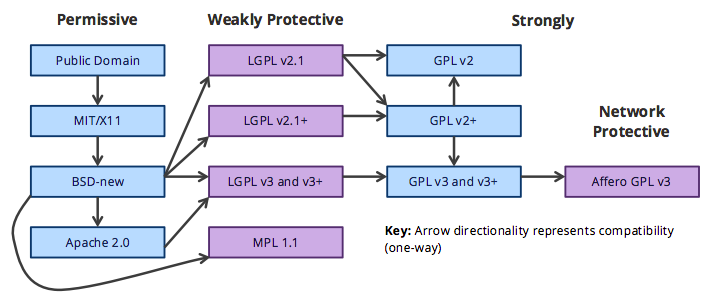

# Giving and receiving credits

How do we make sure that others credit our work and we credit others?

We’ve often heard of Copyright, the authors’ and composers’ rights represented by the symbol ©. 
It means All rights reserved therefore, we can’t do anything with work that’s copyright protected, unless we get permission directly from the author or composer, his or her representative (editor) or collective societies entrusted by authors and composers to manage their rights.

On the other hand, there exists the Copyleft, giving permission to anyone to copy, broadcast, use, modify and distribute work as long as some rights are reserved fairly. The author who chooses Copyleft lets other creators of the world know that they can do what they want with his or her work (within the limits of morality).

Although Copyright and Copyleft are on opposite sides of the spectrum, there are additional parameters we can use. For instance, Creative Commons, provides the spectrum and helps us legally share our knowledge and creativity to build a more equitable, accessible, and innovative world — unlocking the full potential of the internet to drive a new era of development, growth and productivity.

Creative Commons lets you create licenses by choosing one or more permissions based on parameters like copying your work, modifying (remixing) it, sharing it, broadcasting it, distributing it, reusing it, and its attribution (giving due credit to its author). Different combinations are available.

- Open source code licences (MIT/Open Canada)
- Information licences (Creative Commons)

- Github (other examples can be found [here](https://2015.igem.org/Team:Cambridge-JIC/OpenHardwareRevolution))

