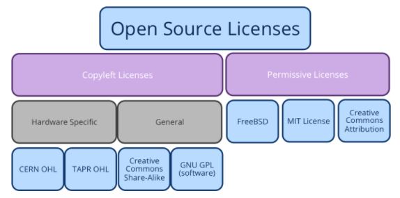
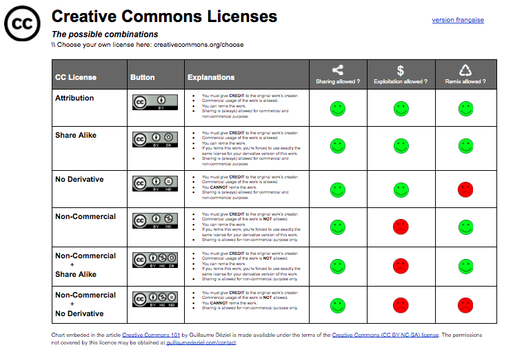
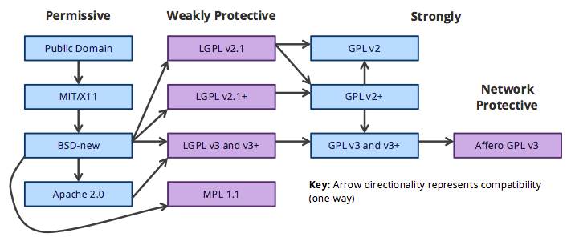

# Giving and receiving credits

How do we ensure that others properly credit our work while we also appropriately acknowledge and credit the work of others?

Giving credit is an important aspect of open science, reproducible research, software development, and collaborative workflows. Proper attribution supports transparency, academic integrity, collaboration, and ethical reuse of knowledge and creative work.

We are all familiar with **Copyright**, the legal rights of authors, artists, composers, and creators, often represented by the symbol ©.

Traditionally, copyright means **“All Rights Reserved.”** In practice, this means that others cannot copy, distribute, modify, reuse, or publicly share copyrighted work without obtaining permission directly from the creator, publisher, editor, or another authorized representative.

Copyright plays an important role in protecting intellectual property and ensuring creators receive appropriate recognition and control over how their work is used.

On the other hand, there is the concept of **Copyleft**, which takes a more open approach by allowing others to copy, use, modify, distribute, and share work, provided that certain rights and conditions are preserved fairly.

Authors who choose Copyleft-style licensing are intentionally encouraging collaboration, sharing, adaptation, and reuse of their work within defined conditions. In many cases, derivative works must also remain open and properly attributed.

Although Copyright and Copyleft are often viewed as opposite ends of a spectrum, there are several flexible licensing approaches that exist between them.

One of the most widely used systems is **Creative Commons (CC)** licensing.

Creative Commons provides a standardized framework that allows creators to legally share their work while still defining how others may use it. These licenses help support a more equitable, accessible, innovative, and collaborative digital environment.

Creative Commons licensing helps unlock the potential of open knowledge, open education, and open science by enabling creators to clearly communicate reuse permissions without requiring users to request permission individually.

Creative Commons licenses allow creators to choose one or more permissions related to:

- copying,
- sharing,
- distributing,
- remixing,
- modifying,
- adapting,
- reusing,
- and attributing work.

Different combinations of permissions and restrictions are available depending on how open the creator wants the work to be.

Some common conditions include:

- **Attribution (BY)** — users must give proper credit to the creator.
- **ShareAlike (SA)** — derivative works must use the same license.
- **NonCommercial (NC)** — work cannot be used commercially.
- **NoDerivatives (ND)** — modifications are not permitted.

These licensing systems help make research, educational materials, software, and creative products easier to share and reuse responsibly.

## Examples of open licensing

### Open-source software licenses

Examples include:

- MIT License  
- Apache License  
- GNU General Public License (GPL)  
- Open Government License – Canada  

These licenses are commonly used for software, code repositories, scripts, and computational tools.

### Information and content licenses

Examples include:

- Creative Commons licenses  
- Open Data Commons licenses  
- Open Government licenses  

These licenses are often used for:
- reports,
- datasets,
- figures,
- educational materials,
- websites,
- and publications.

## GitHub and open collaboration

Platforms such as GitHub have significantly expanded opportunities for open collaboration and reproducible workflows by enabling users to:

- share code and documentation,
- track changes over time,
- collaborate across teams,
- reuse existing tools and workflows,
- and contribute improvements to shared projects.

Many open-source projects also provide contribution guidelines, licenses, and citation instructions to help ensure contributors receive proper recognition.

Additional examples of open hardware and open collaboration initiatives can be found [here](https://2015.igem.org/Team:Cambridge-JIC/OpenHardwareRevolution).

## Why attribution matters

Proper attribution is important because it:

- recognizes the contributions of creators and collaborators,
- supports transparency and reproducibility,
- encourages collaboration and knowledge sharing,
- helps users trace the origins of methods and ideas,
- and promotes ethical and responsible reuse of intellectual work.

In reproducible and open research workflows, giving and receiving credit is not only a legal issue but also a professional and ethical responsibility.