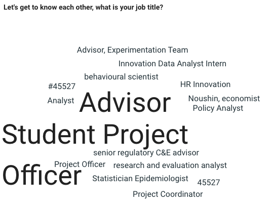
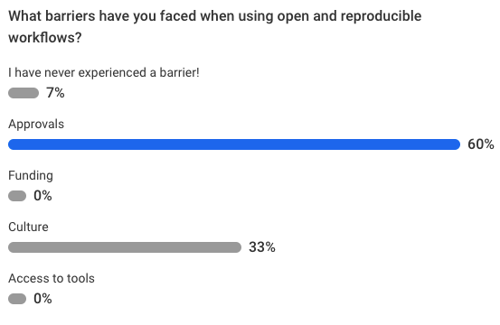
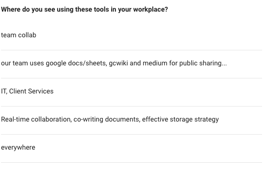

# Resources

This section provides a collection of useful resources related to reproducible research, open science, Git and GitHub, R Markdown, data management, transparency, and reproducible analytical workflows.

The resources below include:

- books,
- online courses,
- blogs,
- tutorials,
- policy frameworks,
- technical guides,
- and practical examples.

These materials can help deepen understanding of reproducible methodologies and support the development of reproducible workflows in research, industry, and public-sector analytics.

## Blogs, websites, books, and courses

### Reproducible research and open science

- Matthew Shotwell's slides (2011):  
  ["Approaches and Barriers to Reproducible Practices in Biostatistics"](https://rstudio-pubs-static.s3.amazonaws.com/177032_7be0bffdc2274d679c03b7228ac7b91f.html)

- NIH Training Module:  
  [Reproducibility Through Rigor and Transparency](https://grants.nih.gov/reproducibility/module_1/presentation.html)

- Gandrud, Christopher.  
  [*Reproducible Research with R and RStudio*](https://englianhu.files.wordpress.com/2016/01/reproducible-research-with-r-and-studio-2nd-edition.pdf), CRC Press, 2013.

- Xie, Yihui.  
  [*Dynamic Documents with R and knitr*](http://static.latexstudio.net/wp-content/uploads/2014/03/DDR-Yihui-Xie-Chap1-3.pdf), CRC Press, 2013.

- ROpenSci blog post:  
  ["Reproducible research is still a challenge"](https://ropensci.org/blog/2014/06/09/reproducibility/)  
  by R. FitzJohn, M. Pennell, A. Zanne, and W. Cornwell.

- Karl Broman's course:  
  ["Tools for Reproducible Research"](http://kbroman.org/Tools4RR/)  
  University of Wisconsin–Madison.

- Johns Hopkins University course on Coursera:  
  ["Reproducible Research"](https://www.coursera.org/learn/reproducible-research)  
  by Roger Peng, Jeff Leek, and Brian Caffo.

- Stodden, Victoria, Friedrich Leisch, and Roger D. Peng (Editors).  
  [*Implementing Reproducible Research*](https://www.jstatsoft.org/article/view/v061b02/v61b02.pdf), CRC Press, 2014.

- ROpenSci reproducibility guide:  
  [Reproducible Research and Open Science](https://ropensci.github.io/reproducibility-guide/sections/introduction/)

### Git and version control

- StackOverflow discussion:  
  ["Why should I use version control?"](https://stackoverflow.com/questions/1408450/why-should-i-use-version-control)

- Learn GitHub interactively:  
  [Learn Git on GitHub](https://try.github.io/levels/1/challenges/1)

- Karl Broman's reproducibility tools course:  
  [Tools for Reproducible Research](https://kbroman.org/Tools4RR/)

- BC Government policy framework:  
  [BC Government Framework for GitHub](https://github.com/bcgov/BC-Policy-Framework-For-GitHub)

Version control systems such as Git are fundamental tools for collaborative, transparent, and reproducible analytical workflows.

### R, R Markdown, and data science workflows

- Reproducible Research with R and RStudio:  
  http://christophergandrud.github.io/RepResR-RStudio/

- Making slides with the Xaringan package in R Markdown:  
  https://arm.rbind.io/slides/xaringan.html

- Data wrangling with R:  
  https://cengel.github.io/R-data-wrangling/

- Data cleaning with R and tidyverse:  
  https://towardsdatascience.com/data-cleaning-with-r-and-the-tidyverse-detecting-missing-values-ea23c519bc62

- Gallery of missing data visualization tools:  
  https://cran.r-project.org/web/packages/naniar/vignettes/naniar-visualisation.html

- How R handles missing values:  
  https://stats.idre.ucla.edu/r/faq/how-does-r-handle-missing-values/

These resources provide practical examples for building reproducible analytical workflows using R and related tools.

### Reproducibility and scientific challenges

- What does research reproducibility mean?  
  https://stm.sciencemag.org/content/8/341/341ps12

- Challenge to scientists: Does your ten-year-old code still run?  
  https://www.nature.com/articles/d41586-020-02462-7

These resources discuss broader scientific and computational reproducibility challenges, including software sustainability, documentation, and long-term maintainability.

### Data privacy and security

- Data privacy versus security:  
  https://dataprivacymanager.net/security-vs-privacy/

Reproducibility must often be balanced with privacy, confidentiality, and security requirements, particularly in public-sector and health-related analytics.

## Additional suggested resources

Additional useful topics for further exploration include:

- FAIR data principles,
- open science frameworks,
- reproducible machine learning,
- computational notebooks,
- Quarto publishing,
- Docker and containerization,
- workflow automation,
- cloud-based collaboration tools,
- and research data management practices.

As reproducible workflows continue to evolve, staying familiar with emerging tools and practices becomes increasingly valuable.

## Participant polls

The following participant polls were collected during workshop sessions and provide insight into participants’ experiences, perspectives, and familiarity with reproducible workflows and tools.

